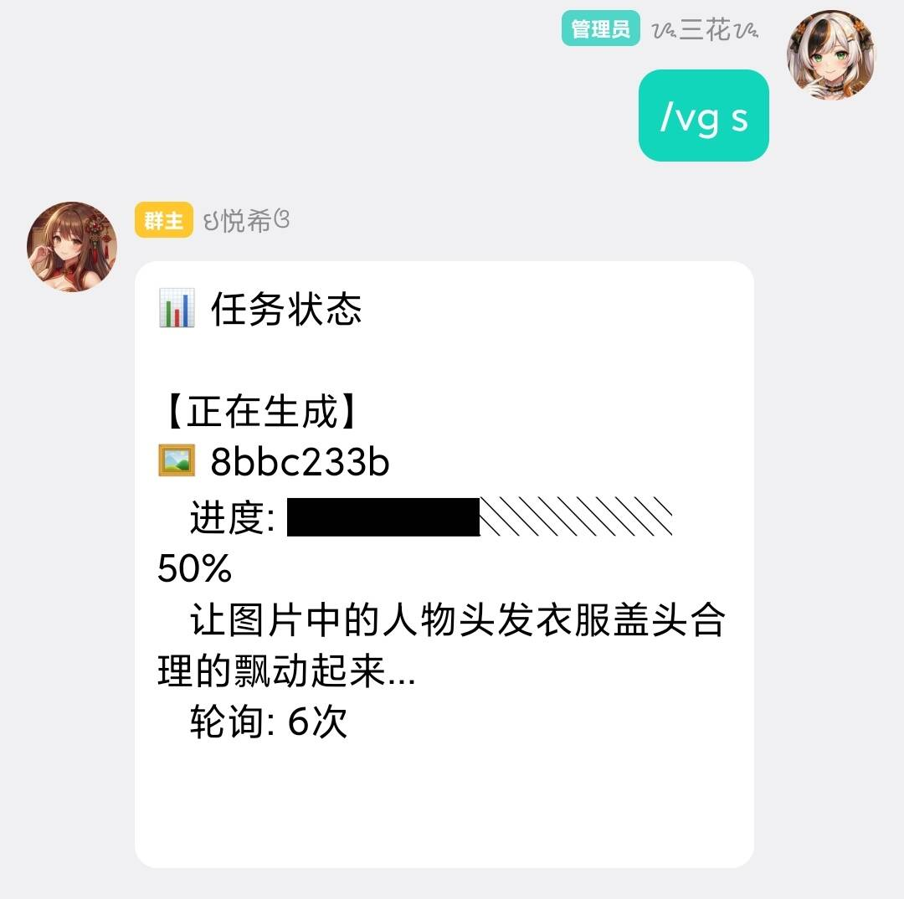

# 🎬 Video Generator Plugin（视频生成插件）

<div align="center">


**支持多服务商的 AI 视频生成插件，让你的 MaiBot 拥有文生视频、图生视频能力**

[快速开始](#-快速开始) • [使用指南](#-使用指南) • [配置说明](#-配置说明) • [常见问题](#-常见问题)

</div>


## 🎯 核心功能

| 功能 | 说明 |
|------|------|
| 📝 **文生视频** | 根据文字描述自动生成视频 |
| 🖼️ **图生视频** | 基于图片生成动态视频 |
| 🎬 **首帧控制** | 指定视频的起始画面 |
| 🎞️ **尾帧控制** | 指定视频的结束画面 |
| 🔄 **首尾帧模式** | 同时控制起始和结束画面，实现精准过渡 |
| 🎵 **背景音乐** | 自动生成匹配的背景音乐（部分模型支持） |


## 🏢 多服务商支持

| 服务商 | 文生视频 | 图生视频 | 首尾帧 | 背景音乐 |
|--------|:--------:|:--------:|:------:|:--------:|
| 🔥 火山引擎（豆包） | ✅ | ✅ | ✅ | ✅ |
| ☁️ 阿里云（通义万相） | ✅ | ✅ | ❌ | ✅ |
| 🧠 智谱（CogVideoX） | ✅ | ✅ | ✅ | ✅ |
| 🔌 OpenAI 兼容 | ✅ | ✅ | - | - |

### 🛠️ 高级特性

- **📋 预设模板** - 关键词快速调用预设参数
- **🔄 热切换模型** - 运行时无缝切换不同模型
- **📊 任务队列** - 自动排队处理多个生成请求
- **⏸️ 断点续传** - 大文件下载中断后自动续传
- **🎯 智能轮询** - 指数退避策略，减少 API 调用
- **🌐 WebUI 集成** - 可视化配置管理


## 🚀 快速开始

### 环境要求
- MaiBot 版本 >= 0.7.0
- Python >= 3.9
- 至少一个视频生成服务商的 API Key

### 安装步骤
#### 1️⃣ 下载插件
## 方式一：Git Clone（推荐）
```bash
cd your_maibot_path/plugins
git clone https://github.com/yueshenqiu/video_generator_plugin.git

```
## 方式二：手动下载
下载 Release 压缩包，解压到 plugins 目录


## 安装 Python 依赖
```bash
pip install -r requirements.txt

```

## 配置 API Key
**方式一：通过 WebUI 配置（推荐）**

- 启动 MaiBot
- 打开 WebUI 管理面板
- 进入「插件管理」→「视频生成插件」→「配置」
- 在「模型管理」标签页填写 API Key

**方式二：编辑配置文件**

编辑 config.toml 文件：
```bash
[models.model1]
name = "豆包视频生成"
api_key = "your-api-key-here"  # 填写你的 API Key
format = "volcengine"
model = "doubao-seedance-1-5-pro-251215"

```
#### 重启 MaiBot
#### 重启后插件会自动加载


## 获取 API Key
- 火山引擎	console.volcengine.com	需开通「豆包大模型」服务
- 阿里云	dashscope.console.aliyun.com	需开通「通义万相」服务
- 智谱	open.bigmodel.cn	需开通「CogVideoX」服务


## 📖 使用指南

### 基础命令
- /vg <提示词>              文生视频（有图时自动图生视频）
- /vg help                  显示帮助信息
### 图生视频模式
- /vg <提示词>              自动检测最近图片（首帧模式）
- /vg f <提示词>            强制首帧模式
- /vg r <提示词>            尾帧模式
- /vg fr <提示词>           首尾帧模式（需要2张图片）

### 参数设置
- /vg 720p <提示词>         指定分辨率（480p/720p/1080p/4k）
- /vg 720p 30 <提示词>      分辨率 + 帧率
- /vg 720p 30 10 <提示词>   分辨率 + 帧率 + 时长（秒）

### 背景音乐
- /vg mu <提示词>           添加背景音乐（默认风格）
- /vg mu50 <提示词>         指定音量（0-100）
- /vg cinematic <提示词>    指定音乐风格

#### 支持的音乐风格：
cinematic（电影感）、upbeat（欢快）、calm（平静）、dramatic（戏剧性）、romantic（浪漫）、sad（悲伤）、mysterious（神秘）、energetic（活力）、peaceful（宁静）、epic（史诗）

### 查询命令
- /vg c                     查看当前配置
- /vg m                     查看可用模型
- /vg t                     查看预设模板
- /vg s                     查看任务状态
- /vg y                     查看音乐风格
- /vg caps                  查看当前模型能力
- /vg caps <模型ID>         查看指定模型能力

### 管理命令（需管理员权限）
- /vg w <模型ID>            切换模型
- /vg d <任务ID>            取消任务


## 🎬 使用示例
**首尾帧图生视频**

以下演示如何使用首尾帧模式生成视频：
- 第一步：发送两张图片并输入命令
先在聊天中发送两张图片（第一张为首帧，第二张为尾帧），然后发送命令：


- 第二步：查看生成进度

使用 /vg s 命令查看任务状态和生成进度：


- 第三步：获取生成结果

视频生成完成后会自动发送到聊天中：


## ⚙️ 配置说明

**配置文件结构**
video_generator_plugin/
├── config.toml          # 主配置文件

### 主要配置项
**插件设置 [plugin]**
- 配置项       类型       默认值       说明
- enabled    bool       true       是否启用插件

**管理员设置 [admin]**
- 配置项                     类型              默认值              说明
- admin_users              list                 []              管理员 QQ 号列表

**生成设置 [generation]**
配置项                            类型              默认值                说明
- default_model             string              "model1"       默认使用的模型
- default_resolution       string              "720p"           默认分辨率
- default_fps                   int                 24                  默认帧率
- default_duration           int                 5                   默认时长（秒）

**队列设置 [queue]**
- 配置项                     类型              默认值                说明
- max_queue_size       int                 10               最大队列长度
- task_timeout            int                600              任务超时时间（秒）
- poll_interval             int                  5               基础轮询间隔（秒）

**模型配置 [models.modelX]**
- 配置项                               类型                            说明
- name	                        string                模型显示名称
- base_url	                        string                  API 地址
- api_key                             string                 API 密钥
- format                              string                 API 格式（volcengine/aliyun/zhipu/openai）
- model                              string                 模型标识符
- default_resolution            string                  该模型默认分辨率
- default_duration                 int                    该模型默认时长
- support_img2video           bool                  是否支持图生视频


## ❓ 常见问题

Q: 任务一直显示排队中？
A: 请检查：
- API Key 是否正确配置
- 服务商账户是否有余额
- 查看日志确认是否有错误信息


Q: 图生视频没有识别到图片？
A: 请确保：
- 图片在发送命令前 5 分钟内发送
- 图片格式为 JPG/PNG/WEBP
- 尝试在图片消息后立即发送命令


Q: 视频下载失败？
A: 插件支持断点续传，可以：
- 等待自动重试
- 重新使用 /vg s 查看状态
- 检查网络连接


Q: 如何添加新模型？
A: 在 config.toml 中[models.model3]后添加新的模型即可：
```bash
[models.model4]
name = "新模型"
api_key = "your-api-key"
format = "volcengine"  # 或其他支持的格式
model = "model-name"
support_img2video = true

```
### 我想说
**第一次弄，很史我知道，有问题先问问AI，我代码都是claude-opus-4-5生成的，别告诉我你不会用AI，真不会用打屁屁。最后感谢一下耐心解答我那些飞舞问题的大家，我人真的麻了，有了这次经验，后面也许再弄就会顺手一点吧？“憋笑”。**


## 🤝 贡献
欢迎提交 Issue 和 Pull Request！

## 📄 许可证
本项目采用 GNU General Public License v3.0 许可证。

## 🙏 致谢
- MaiBot - 优秀的 AI 机器人框架

- 火山引擎、阿里云、智谱 - 提供强大的视频生成 API

- 如果这个插件对你有帮助，请给个 ⭐ Star 支持一下！


Made with ❤️ by 三花


